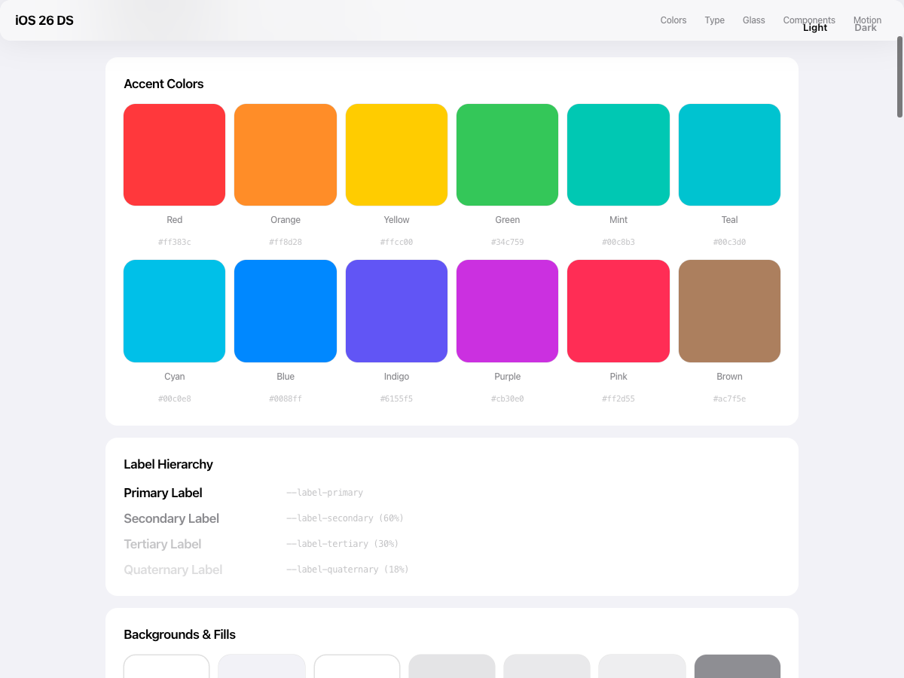
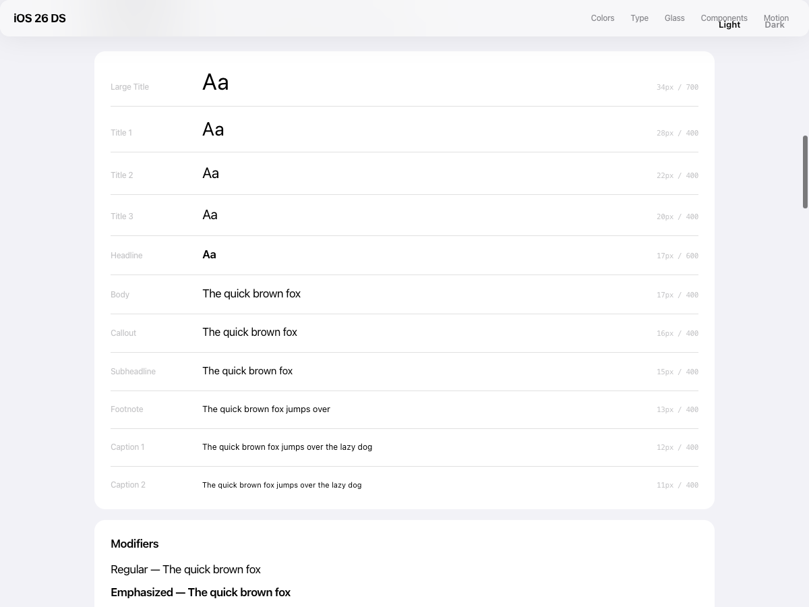
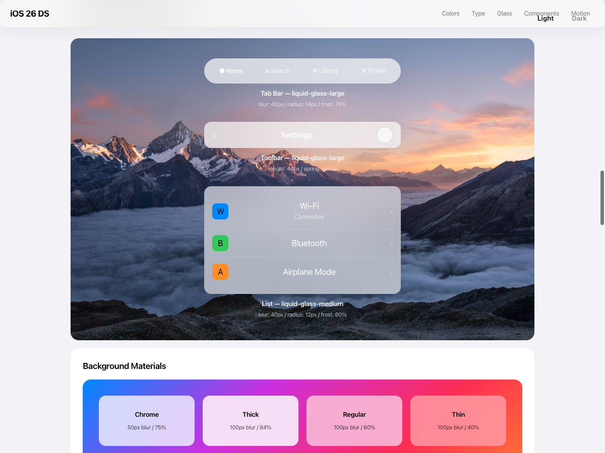
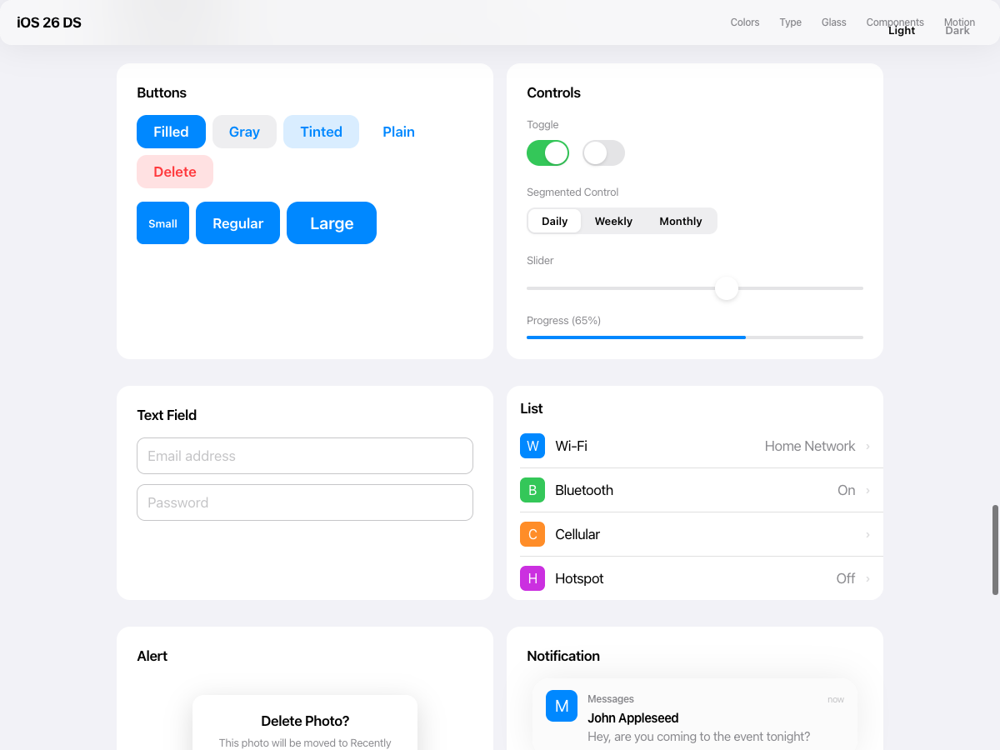
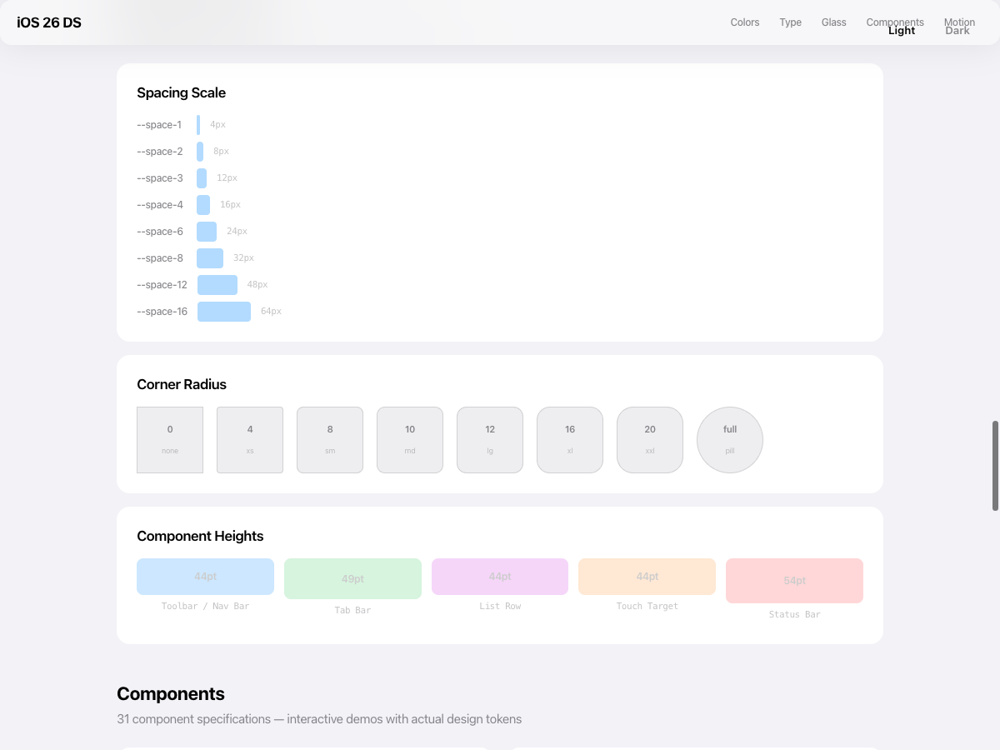
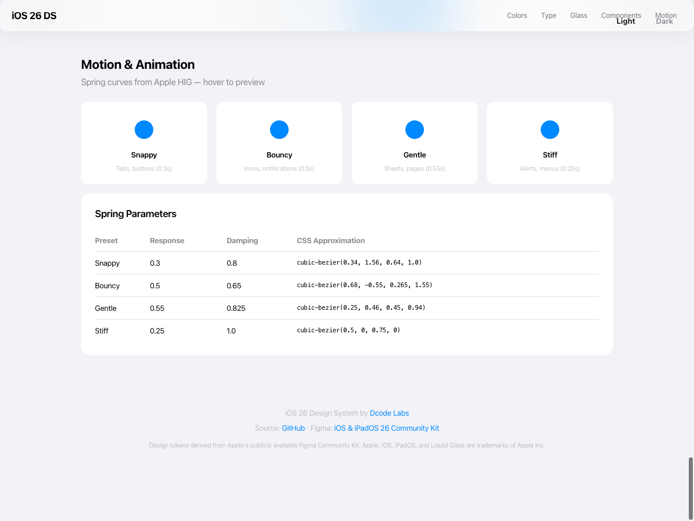

<p align="center">
  
</p>

<h1 align="center">iOS 26 Design System</h1>

<p align="center">
  <strong>가장 완전한 오픈소스 iOS 26 / iPadOS 26 디자인 시스템</strong><br/>
  토큰, 컴포넌트, 템플릿, 섹션, 페이지 — Apple 공식 Figma Community Kit에서 추출
</p>

<p align="center">
  <a href="https://seunghan91.github.io/ios26-design-system/demo/">🔴 라이브 데모</a> ·
  <a href="./README.md">English</a> · <a href="./README.ja.md">日本語</a> · <a href="./README.zh.md">中文</a>
</p>

<p align="center">
  
  
  
  
  
</p>

---

## 미리보기

> 아래 모든 스크린샷은 목업이 아닌, 이 패키지의 **실제 디자인 토큰**으로 렌더링되었습니다.

### 시스템 컬러

<p align="center">
  
</p>

### 타이포그래피

<p align="center">
  
</p>

### Liquid Glass & Materials

<p align="center">
  
</p>

### 컴포넌트

<p align="center">
  
</p>

### 간격 & 레이아웃

<p align="center">
  
</p>

### 모션 & 애니메이션

<p align="center">
  
</p>

---

## 왜 만들었나

Apple이 WWDC25에서 **Liquid Glass**와 완전히 새로운 디자인 언어를 발표했습니다. 디자이너들은 Figma 키트를 받았지만, **개발자들은 아무것도 받지 못했습니다.**

이 프로젝트는 그 간극을 메웁니다. 모든 토큰, 모든 컴포넌트 스펙, 모든 레이아웃 규칙을 [공식 Figma Community Kit](https://www.figma.com/community/file/1527721578857867021)에서 추출하여, **4개 프레임워크**에서 **지금 바로** 사용할 수 있는 코드로 변환했습니다.

## 설치

```bash
# 디자인 토큰 (CSS 변수, JS/TS, Dart)
npm install @ios26_design_system/tokens

# 프레임워크별 패키지
npm install @ios26_design_system/svelte          # Svelte 5
npm install @ios26_design_system/rails           # Rails 8 + Hotwire
npm install @ios26_design_system/svelte-inertia  # Svelte 5 + Inertia.js

# 컴포넌트 스펙, 페이지 레시피 (문서/AI 컨텍스트용)
npm install @ios26_design_system/metadata
```

## 프로젝트 구조

```
ios26-design-system/                 # pnpm 모노레포 + Turborepo
├── packages/
│   ├── tokens/                      # @ios26_design_system/tokens
│   │   ├── src/                     # 소스 JSON (5개 파일)
│   │   │   ├── colors.json          # 79개 변수 × 4 모드
│   │   │   ├── typography.json      # 11개 스타일 × 4 변형 + Dynamic Type
│   │   │   ├── materials.json       # Liquid Glass + Background Materials
│   │   │   ├── spacing.json         # 8pt 그리드, 둥글기, Safe Area
│   │   │   └── animations.json      # Spring 커브, Liquid Glass 모핑
│   │   ├── dist/                    # 빌드 결과물 (자동 생성)
│   │   │   ├── css/                 # CSS 커스텀 프로퍼티
│   │   │   ├── index.js / .cjs     # JS/TS 모듈
│   │   │   └── dart/                # Flutter Dart 클래스
│   │   └── build.js                 # 토큰 변환 파이프라인
│   │
│   ├── svelte/                      # @ios26_design_system/svelte
│   ├── rails/                       # @ios26_design_system/rails
│   ├── svelte-inertia/              # @ios26_design_system/svelte-inertia
│   ├── flutter/                     # pub.dev: ios26_design
│   └── metadata/                    # @ios26_design_system/metadata
│       ├── components/specs/        # 31개 컴포넌트 스펙
│       ├── templates/               # 5개 레이아웃 조합 패턴
│       ├── sections/                # 5개 화면 영역 스펙
│       └── pages/                   # 48개 페이지 레시피 (iPhone + iPad)
│
├── skills/                          # Claude Code / AI 스킬
│   └── ios26-design.md              # 전체 토큰 + 컴포넌트 레퍼런스
│
├── turbo.json                       # 빌드 오케스트레이션
└── pnpm-workspace.yaml              # 모노레포 워크스페이스
```

## 프레임워크 지원

| 패키지 | 프레임워크 | 토큰 | 컴포넌트 | 상태 |
|--------|-----------|------|---------|------|
| `@ios26_design_system/tokens` | 모든 프레임워크 | JSON, CSS, JS/TS, Dart | — | `npm install @ios26_design_system/tokens` |
| `@ios26_design_system/svelte` | Svelte 5 | CSS Custom Properties | Runes mode | `npm install @ios26_design_system/svelte` |
| `@ios26_design_system/svelte-inertia` | Svelte 5 + Inertia.js | CSS Custom Properties | + Rails 레이아웃 | `npm install @ios26_design_system/svelte-inertia` |
| `@ios26_design_system/rails` | Rails 8 + Hotwire | CSS + Stimulus | ERB 파셜 | `npm install @ios26_design_system/rails` |
| `@ios26_design_system/metadata` | 모든 프레임워크 | — | 31개 스펙 + 48개 페이지 | `npm install @ios26_design_system/metadata` |
| `ios26_design` | Flutter 3.x | Dart 상수 | Material + Cupertino | pub.dev (준비 중) |

## 빠른 시작

### 토큰 (모든 프레임워크)

```bash
npm install @ios26_design_system/tokens
```

```js
// ES Module — 토큰 객체 임포트
import { colors, typography, materials } from '@ios26_design_system/tokens';

// CSS — 커스텀 프로퍼티로 임포트
import '@ios26_design_system/tokens/css';              // 컬러
import '@ios26_design_system/tokens/css/typography';   // 타이포그래피 클래스
import '@ios26_design_system/tokens/css/materials';    // Liquid Glass 유틸리티
import '@ios26_design_system/tokens/css/animations';   // Spring 커브 + 지속 시간

// Raw JSON — 커스텀 빌드 파이프라인용
import colors from '@ios26_design_system/tokens/json/colors';
```

### Svelte 5

```bash
npm install @ios26_design_system/svelte
```

```svelte
<script>
  import '@ios26_design_system/svelte/tokens.css';
  import '@ios26_design_system/svelte/typography.css';
  import '@ios26_design_system/svelte/materials.css';
</script>

<button class="ios26-button ios26-liquid-glass-sm">완료</button>
```

### Flutter

```dart
// pubspec.yaml: ios26_design: ^1.0.0
import 'package:ios26_design/ios26_theme.dart';

MaterialApp(
  theme: iOS26Theme.light(),
  darkTheme: iOS26Theme.dark(),
);
```

### Rails 8

```erb
<%# Gemfile 또는 importmap: pin "@ios26_design_system/rails" %>
<%= stylesheet_link_tag "ios26/tokens" %>
<%= render "shared/ios26/toolbar", title: "설정" %>
```

## 컴포넌트 스펙

모든 컴포넌트 스펙에 포함된 항목:

| 항목 | 설명 |
|------|------|
| **치수** | 정확한 width, height, padding (pt 단위) |
| **변형** | 모든 축: Size × Style × State × Mode |
| **토큰 매핑** | 어떤 컬러/타이포그래피 토큰이 어디에 사용되는지 |
| **상태 전환** | Default → Pressed → Disabled |
| **애니메이션** | Spring 커브, 지속 시간, 이징 |
| **접근성** | 최소 44×44pt 터치 타겟, 대비율 |
| **프레임워크별 노트** | 각 프레임워크 구현 힌트 |

### 컴포넌트 목록 (총 31개)

| 분류 | 컴포넌트 |
|------|---------|
| **핵심** | Tab Bar, Toolbar, Button (148개 변형), List Row |
| **피드백** | Alert, Sheet, Notifications, Progress Indicators |
| **컨트롤** | Segmented Control, Toggle, Slider, Stepper, Text Field, Picker |
| **네비게이션** | Sidebar, Menu, Context Menu, Action Sheet, Popover |
| **시스템** | Keyboard, Widget, App Icon, Face ID, Window, System UI |

## 페이지 레시피

각 페이지 레시피는 완성 화면을 구성하는 템플릿 + 컴포넌트로 분해합니다:

**iPhone (25개 화면):** 홈 피드, 설정, 목록, Sheet 폼, Alert, 알림, 키보드, 위젯, 잠금 화면, 제어 센터 등.

**iPad (23개 화면):** Split View, 사이드바, Popover, 멀티태스킹, 윈도우, Form Sheet 등.

## Liquid Glass

iOS 26의 핵심 시각 요소입니다. 이 디자인 시스템은 완전한 Liquid Glass 스펙을 포함합니다:

```
Liquid Glass = Frosted blur + Refraction + Depth shadow + Light angle

파라미터 (Figma 변수에서 추출):
├── lightAngle: -45°
├── opacity: 60%
├── refraction: 100%
├── frostRadius: 7px (small) / 12px (medium) / 14px (large)
├── depth: 16
├── splay: 6
└── shadowBlur: 40px (레이어) / 80px (배경)
```

`animations.json`에는 Liquid Glass 모핑 키프레임이 포함되어 있습니다 — 이동 중 늘어나는 "물방울" 탭 인디케이터 애니메이션:

```json
{
  "liquidGlass": {
    "tabIndicator": {
      "duration": 0.45,
      "spring": "snappy",
      "cssApprox": "cubic-bezier(0.34, 1.56, 0.64, 1.0)"
    }
  }
}
```

## 출처

모든 데이터는 Apple의 공식 **iOS & iPadOS 26 Figma Community Kit**에서 추출했습니다.

- **Figma Community Kit**: [iOS & iPadOS 26](https://www.figma.com/community/file/1527721578857867021)
- **Figma File Key**: `pDmGXdYu2k8xlf1SQoU9PW` (Figma API / MCP 접근용)
- **추출 방법**: Figma MCP + 수동 검증
- **모드**: Light, Dark, Increased Contrast Light, Increased Contrast Dark

## 아키텍처

**Atomic Design** 방법론을 따릅니다:

```
Tokens (원자) → Components (분자) → Templates (유기체) → Sections → Pages
```

각 레이어는 하위 레이어를 참조합니다. 컴포넌트 스펙은 토큰 값을 참조하고, 템플릿은 컴포넌트를 조합하며, 페이지는 템플릿을 사용합니다.

## AI / 바이브 코딩 연동

이 디자인 시스템에는 **Claude Code 스킬**이 포함되어 있어, AI 어시스턴트에게 iOS 26 토큰, 컴포넌트 치수, 애니메이션 파라미터, 레이아웃 패턴에 대한 완전한 지식을 제공합니다.

### 스킬 설치

```bash
# 다운로드 및 설치
curl -LO https://github.com/seunghan91/ios26-design-system/raw/main/skills/ios26-design.skill
claude install-skill ios26-design.skill
```

또는 스킬 폴더를 수동 복사:

```bash
git clone https://github.com/seunghan91/ios26-design-system.git
cp -r ios26-design-system/skills/ios26-design ~/.claude/skills/
```

### 스킬 제공 내용

| 파일 | 내용 |
|------|------|
| `SKILL.md` | 토큰 퀵 레퍼런스, 컴포넌트 치수, Liquid Glass 파라미터, 애니메이션 커브 |
| `references/tokens.md` | 전체 79-컬러 × 4-모드 토큰 테이블 |
| `references/components.md` | 31개 컴포넌트 스펙 (높이, 둥글기, 패딩, 변형) |
| `references/layouts.md` | 5개 템플릿 + 48개 페이지 레시피 요약 |
| `references/frameworks.md` | Svelte 5, Rails 8, Flutter, Inertia.js 코드 예시 |

이 스킬은 iOS 26, Liquid Glass, 또는 `@ios26_design_system/*` import를 감지하면 자동 활성화됩니다.

### 다른 AI 도구용

스킬 파일은 일반 Markdown이므로, **Cursor Rules**, **Windsurf**, **GitHub Copilot** 등 모든 AI 코딩 어시스턴트의 컨텍스트로도 활용 가능합니다:

```bash
# Cursor — .cursorrules로 복사
cp skills/ios26-design/SKILL.md .cursorrules

# 모든 AI 도구 — 스킬 폴더를 컨텍스트로 참조
```

## 기여하기

기여를 환영합니다! 도움이 필요한 영역:

- **새 프레임워크**: React Native, SwiftUI 래퍼, Jetpack Compose, Angular
- **다크 모드 개선**: IC (고대비) 모드 검증
- **접근성 감사**: WCAG AAA 준수 확인
- **애니메이션 데모**: 각 프레임워크별 Liquid Glass 라이브 데모
- **추가 페이지**: 실제 앱 화면 레시피 추가

큰 PR을 보내기 전에 이슈를 먼저 열어 논의해 주세요.

## 로드맵

- [x] npm 모노레포 (`@ios26_design_system/tokens`, `@ios26_design_system/svelte`, `@ios26_design_system/rails`, ...)
- [x] 토큰 빌드 파이프라인 (JSON → CSS / JS / Dart)
- [x] Claude Code AI 스킬
- [x] GitHub Actions CI/CD
- [ ] pub.dev Dart 패키지
- [x] [다크 모드 토글이 포함된 라이브 데모](https://seunghan91.github.io/ios26-design-system/demo/)
- [ ] Storybook / Histoire 컴포넌트 갤러리
- [ ] 인터랙티브 Liquid Glass 플레이그라운드
- [ ] React Native 구현체
- [ ] SwiftUI 래퍼 컴포넌트
- [ ] 디자인 시스템 쿼리용 MCP 서버

## 라이선스

MIT License. [LICENSE](./LICENSE) 참조.

디자인 토큰은 Apple의 공개 Figma Community Kit에서 파생되었습니다. Apple, iOS, iPadOS, Liquid Glass는 Apple Inc.의 상표입니다.

---

<p align="center">
  <a href="https://dcode-labs.com">Dcode Labs</a> 제작<br/>
  <sub>도움이 되셨다면 스타 하나가 다른 분들도 찾는 데 도움됩니다.</sub>
</p>
